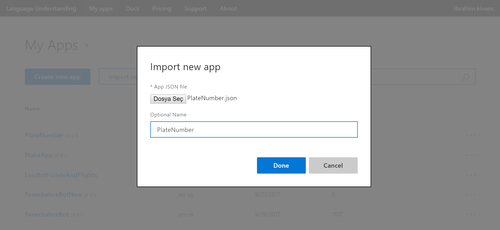
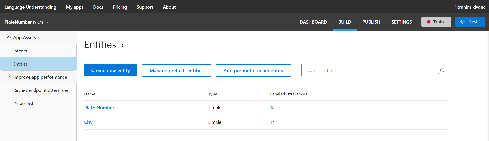
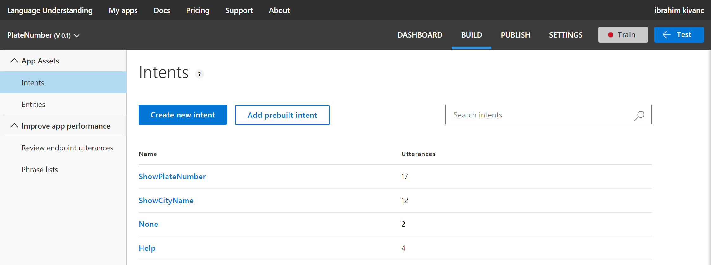
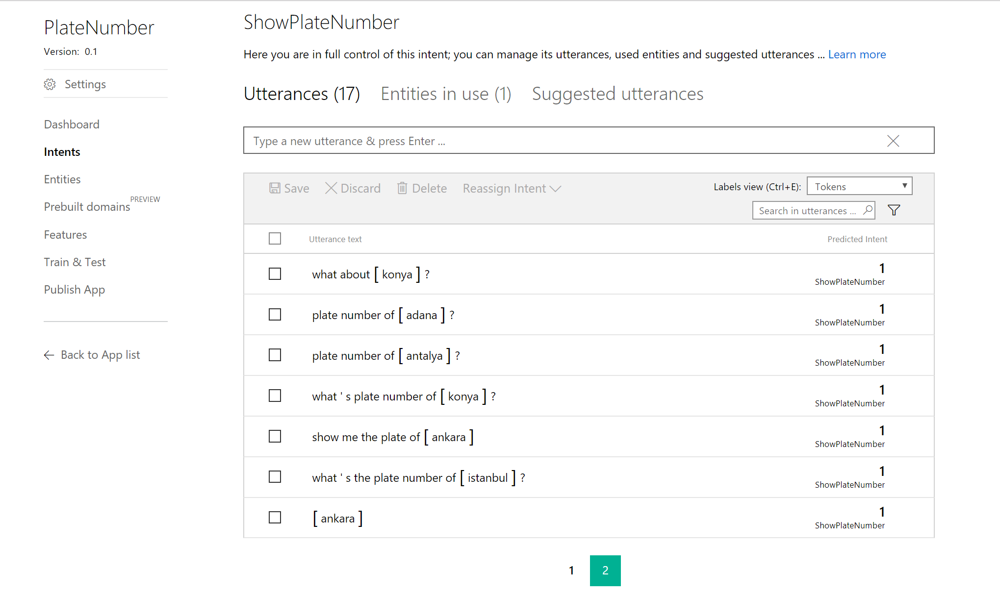
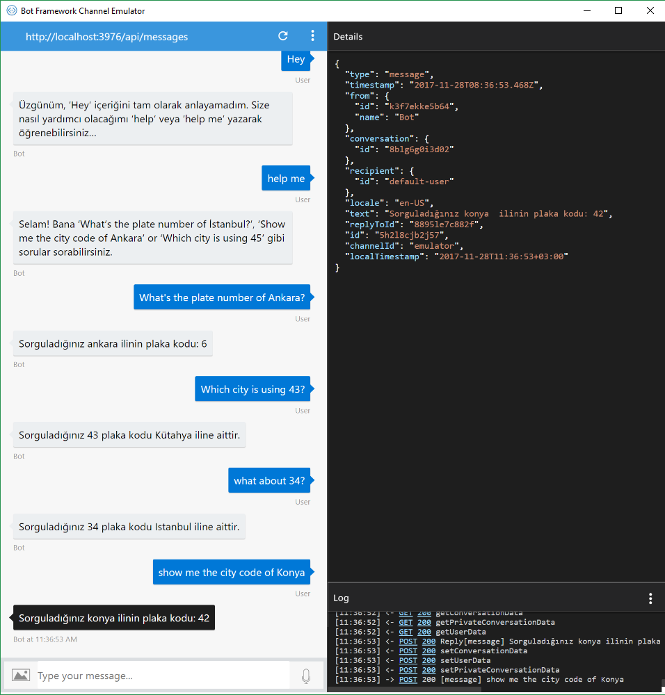

# Şehir-Plaka Kodu Arama ve LUIS ile Doğal Dil Anlama Ekleme

Bir önceki örnekte [Şehir-Plaka kodu arama projesi](https://github.com/ikivanc/TRPlateBot) ile bot framework üzerinde bir chatbot senaryosunda entegre edilmesini incelemiştik.

Bu örnekte de Microsoft Cognitive Services çözümlerinden birisi olan [LUIS - (Language Understanding Intelligence Service)](https://www.luis.ai) ile Natural Language Processing - NLP (Doğal Dil Anlama) için kullanılan bir servisidir.


Şu anda için 12 dili destekleyen bu servisin desteklediği diller aşağıdaki gibi 
* Brazilian Portuguese
* Chinese
* Dutch
* English
* French
* French Canadian
* German
* Italian
* Japanese
* Korean
* Spanish
* Spanish Mexican

Biz de bu örnek'te İngilizce'yi kullanacak ve sonraki örnekte de Türkçe implementasyonun nasıl yapılacağını göreceğiz.

## LUIS'in çalışma mantığı
LUIS içerisidne 3 temel konu karşımıza çıkmakta


``Utterance`` Kullanıcıların sisteme sorduğu sorular olarak düşünebiliriz. Bu cümlelerden hangi aksiyonun ve detayın olduğunu çıkarmaya çalışacağımız terim.

``Intent`` Cümlelerden çıkarılacak anlama göre yapmak istediğiniz anlam. Bunu günlük kullanımımızda düşünecek olursa uygulamalarımız için yazdığımız method veya fonksiyonlar olarak düşünebiliriz. 

``Entities`` Uttarance içerisinde yakalayabileceğiniz kelime veya kelime grubuna denilmektedir. Genellikle bunu cümle içerisinde yakalayabileceğiniz parametreler olarak düşünebilirsiniz. 

Bir örnek üzerinde inceleyecek olursak aşağıdaki örnekler buna örnek olabilir.

|Intent| Örnek kullanıcı Cümlesi |Entities|
|-----------|-----------|-----------|
|Help|"Please can you __help__ me?"|help|
|ShowPlateNumber|"What's the plate number of __Ankara__?"|Ankara|
|ShowCityName|"Which city is using plate number __34__?"| 34|


## LUIS Üzerinde proje oluşturulması
Yeni bir LUIS Projesi oluşturmayı ve adım adım eklemeyi [LUIS dökümantasyonundan](https://docs.microsoft.com/en-us/bot-framework/dotnet/bot-builder-dotnet-luis-dialogs) inceleyebilirsiniz. 

Bu örnekte daha önce oluşturulmuş LUIS yapısını import ederek incelemeyi göreceğiz. Bunun için buradan Şehir-Plaka kodu konusundaki json dosyasını kaydedin. [PlateNumber.json](  
https://github.com/ikivanc/TRPlateBot-LUIS/LUISExport/PlateNumber.json)

Bilgisayarınıza kaydedeceğini bu .json uzantılı dosyayı aşağıdaki gibi my apps bölümün'de Import'a basarak upload edin.


Uygulama upload olduktan sonra aşağıdaki gibi bir dashboard'a erişecek ve BotFramework-LUIS Entegrasyonunda yer alan ``YOUR_LUIS_APP_ID`` 'yi buradan APP ID olarak bulabileceksiniz.


Eğer sağ üst köşeden kendi kullanıcı adınıza tıklarsanız da bu geliştiriciye ait Programatic Key'e ulaşabileceksiniz ve yine bunu BotFramework-LUIS Entegrasyonunda ``YOUR_SUBSCRIPTION_KEY`` yerine kullanabileceksiniz.


Şehir adı ve plaka numaralarını ``Entity`` olarak kaydettiğimiz yapıları aşağıdan görebileceğiniz gibi


Tüm ``Intent`` lere de ve içerisinde kaç farklı cümle tipi ile eğitildiğine Intent bölümünden erişebilirsiniz.


Herhangi bir intent'e tıklanıldığında aşağıdaki gibi sistemi eğitmek için girilen cümle örneklerini ve tespit edilen entityleri ve hangi intent'e gideceğinin oranlarını aşağıdaki gibi görebilirsiniz. 


Şu anda LUIS kullanıma hazırdır, tek yapmanız gereken Train & Test bölümünden bu uygulamayı eğitmek ve ekrandaki sayfadan test etmek.

## LUIS'in Bot Framework projesi içerisine entegre edilmesi

``MessagesController.cs`` içerisinde, ``Post`` methodunun altına bir önceki implementasyondan farklı olarak methodun altında mesajı işlemek yerine Entity ve Intentleri bulmak üzere LUIS içerisinde anlamlandırılması için oluşturduğumuz class'a gönderiyoruz. 
```csharp
...
   //Bu parça dil işleme kısmı entegre olunca çalışacak
    #region LUIS Integration
    if (activity.Type == ActivityTypes.Message)
    {
        await Conversation.SendAsync(activity, () => new RootLuisDialog));
    }
    else
    {
        HandleSystemMessage(activity);
    }
    var response = Request.CreateResponse(HttpStatusCode.OK);
    return response;
    #endregion
...
```

RootLuisDialog.cs 
```csharp 
...
    [LuisModel("<YOUR_LUIS_APP_ID>", "YOUR_SUBSCRIPTION_KEY")] 
    [Serializable]
    public class RootLuisDialog : LuisDialog<object>
    {     
...
```

Aşağıdaki kod parçasında da LUIS üzerindeki her bir Intent için aşağıdaki şekilde karşılık gelecek methodlar yazıyoruz. Sorulan cümle LUIS'e gönderildiğinde dönen cevaba göre karşılık gelen method'a düşmektedir.

``[LuisIntent("None")]`` Eğer sorulan cümle anlaşılamazsa düşeceği default method. 

``[LuisIntent("Help")]`` LUIS üzerinde oluşturduğumuz yardım bölümü, yardım isteklerinie göre düşebilirler.  


``[LuisIntent("ShowCityName")]`` LUIS üzerinde oluşturduğumuz ShowCityName intent'i sayesinde plaka kodu verilerek sorulan şehir isimleri bu methodun içne düşmektedir.

``[LuisIntent("ShowPlateNumber")]`` LUIS üzerinde oluşturduğumuz ShowPlateNumber intent'i sayesinde şehir ismi verilerek plaka/şehir kodu sorulduğunda bu methodun içne düşmektedir.


```csharp 
public class RootLuisDialog : LuisDialog<object>
{     
    [LuisIntent("")]
    [LuisIntent("None")]
    public async Task None(IDialogContext context, LuisResult result)
    {
        string message = $"Üzgünüm, '{result.Query}' içeriğini tam olarak anlayamadım. Size nasıl yardımcı olacağımı 'help' veya 'help me' yazarak öğrenebilirsiniz..";
        await context.PostAsync(message);
        context.Wait(this.MessageReceived);
    }
    
    [LuisIntent("Help")]
    public async Task Help(IDialogContext context, LuisResult result)
    {
        await context.PostAsync("Selam! Bana 'What's the plate number of İstanbul?', 'Show me the city code of Ankara' or 'Which city is using 45' gibi sorular sorabilirsiniz.");
        context.Wait(this.MessageReceived);
    }
    
    [LuisIntent("ShowCityName")]
    public async Task ShowCityName(IDialogContext context, LuisResult result)
    {
        foreach (var searchEntity in result.Entities)
        {
            City cm = new City();
            string cityName = cm.getCityNamebyPlateNumber(Convert.ToInt32(searchEntity.Entity));
            string message = $"Sorguladığınız {searchEntity.Entity} plaka kodu {cityName} iline aittir.";
            if (cityName == null) message = $"Sorguladığınız {searchEntity.Entity} sorgu kayıtlarımızda bulunamadı";                
            await context.PostAsync(message);
            context.Wait(this.MessageReceived);
        }
    }

    
    [LuisIntent("ShowPlateNumber")]
    public async Task ShowPlateNumber(IDialogContext context, LuisResult result)
    {
        foreach (var searchEntity in result.Entities)
        {
            City cm = new City();
            int pNumber = cm.getPlateNumberbyCity(searchEntity.Entity);
            string message = $"Sorguladığınız {searchEntity.Entity}  ilinin plaka kodu: {pNumber}";
            if (pNumber == 0) message = $"Sorguladığınız {searchEntity.Entity} sorgu kayıtlarımızda  bulunamadı";
            await context.PostAsync(message);
            
            context.Wait(this.MessageReceived);
        }
    }
```

## Kod'un emülatör üzerinde çalışması
